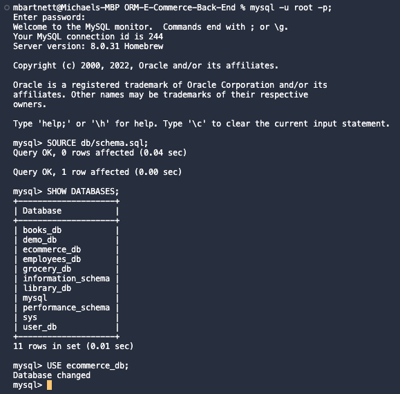
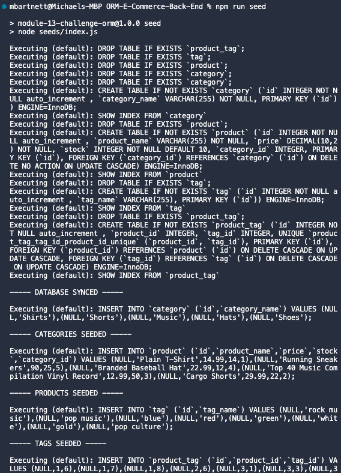
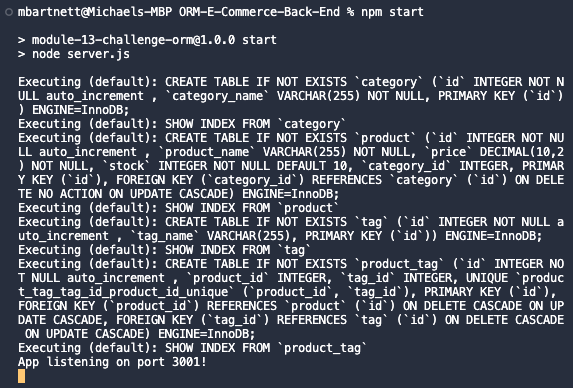
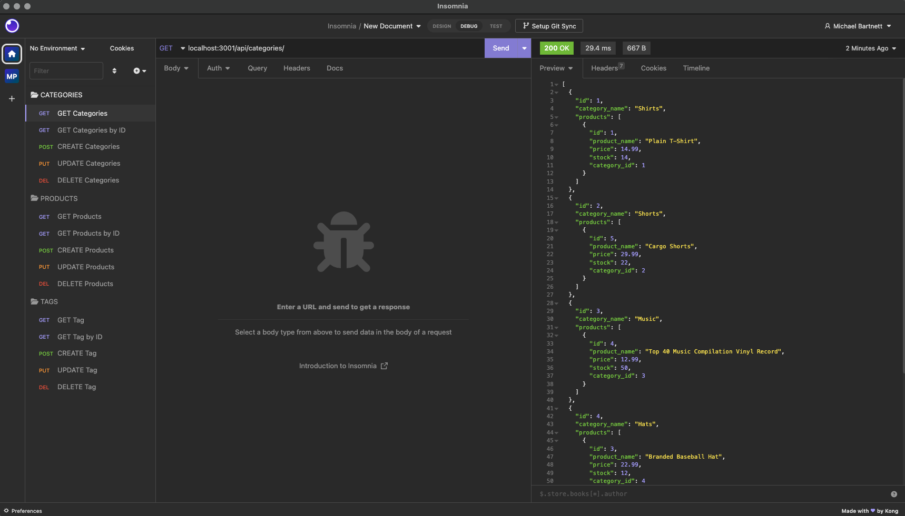

# ORM-E-Commerce-Back-End

## Description

The back end for an e-commerce site that uses an Express.js API and Sequelize to interact with a MySQL database.

## Table of Contents

&bull; [Installation](#installation) 
&bull; [Usage](#usage) 
&bull; [License](#license) 
&bull; [How to Contribute](#how-to-contribute) 
&bull; [Tests](#tests) 
&bull; [Questions](#questions)

## Installation

To use this application you’ll need to install [Node.js](https://nodejs.org/en/), the [MySQL2](https://www.npmjs.com/package/mysql2) and [Sequelize](https://www.npmjs.com/package/sequelize) packages to connect your [Express.js](https://www.npmjs.com/package/express) API to a database, and the [dotenv](https://www.npmjs.com/package/dotenv) package to use environment variables to store sensitive data. You'll also need [Insomnia](https://insomnia.rest/) or a similar application to test the API routes of your models.

## Usage

To test the application, open the terminal in your root directory. Login to MySQL and type the commands 'SOURCE db/schema.sql;', and then 'USE ecommerce_db;'. After quitting MySQL, run the 'npm run seed' command to seed data to your database, and run 'npm start' to start your server. Finally, use Insomnia or a similar application to use the 'GET', 'POST', 'PUT', and 'DELETE' routes on the application's 'Product', 'Category', and 'Tag' models.   
  
  
   
[Video: E-Commerce Back End]([TK](https://drive.google.com/file/d/1q3rb0wnP0-5Zz_g9kcFk9TJKgsLLUMJG/view))

## License

Copyright © 2022, Michael Bartnett, edX Boot Camps LLC. Distributed under the [MIT](https://opensource.org/licenses/MIT) License. 

## How to Contribute

If you have a suggestion that would make this application better, please fork the repo and create a pull request.

## Tests

To test the application, open the terminal in your root directory. Login to MySQL and type the commands 'SOURCE db/schema.sql;' and 'USE ecommerce_db;'. After quitting MySQL, run the 'npm run seed' command to seed data to your database, and run 'npm start' to start your server. Finally, use Insomnia or a similar application to use the 'GET', 'POST', 'PUT', and 'DELETE' routes on the application's 'Product', 'Category', and 'Tag' models. 

## Questions

Contact: mbartnett@gmail.com, [github.com/mbartnett](https://github.com/mbartnett)    
